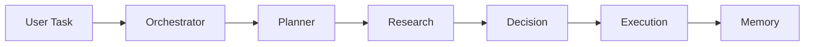
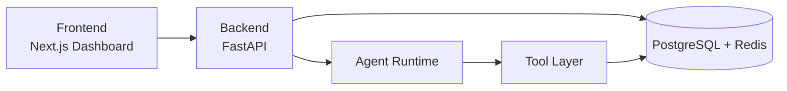

# Cortex - Autonomous AI Workforce

Autonomous multi-agent system that plans, reasons, and executes tasks in real time.


---

## What It Feels Like

You give a task -> a team of AI agents gets to work.

- Plan
- Research
- Decide
- Execute
- Learn

---

## Agent Flow Diagram



---

## System Architecture



---

## Agents Overview

| Agent | Role |
|---|---|
| Orchestrator Agent | Coordinates the full workflow and agent handoffs |
| Planner Agent | Breaks objectives into actionable milestones |
| Research Agent | Gathers context and supporting signals |
| Decision Agent | Chooses strategy from available evidence |
| Execution Agent | Runs tool-driven actions and completes tasks |
| Memory Agent | Stores short-term + long-term context for recall |

---

## Key Features

- `?` Real-time execution
- `??` Multi-agent collaboration
- `??` Memory system
- `??` Tool calling
- `??` Live logs

---

## Demo

Demo mode runs curated scenarios with one-click autopilot for reliable judging.


---

## UI Preview


---

## Quick Start

```bash
git clone https://github.com/abhay-codes07/cortex-ai-agent.git
cd cortex-ai-agent
docker compose -f infra/docker-compose.yml up -d
```

```bash
cd backend
powershell ./run.ps1
```

```bash
cd frontend
npm install
npm run dev
```

Open: `http://localhost:3000/dashboard`

---

## Why This Is Different

- Not chatbot -> execution system
- Visible reasoning and runtime traces
- True multi-agent coordination
- Real-time intelligence in action
